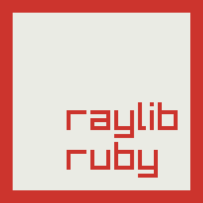

# Raylib for Ruby



Ruby bindings for [raylib](https://www.raylib.com/), a simple and easy-to-use library to enjoy videogames programming.

## Features

- Feature parity with [raylib 4.5](https://github.com/raysan5/raylib/tree/4.5.0)
- **NO external dependencies besides [raylib](https://github.com/raysan5/raylib/tree/4.5.0)**, all required libraries are [bundled into raylib](https://github.com/raysan5/raylib/tree/master/src/external)
- Multiple platforms supported: **Windows, Linux, MacOS, RPI... and more!**
- Hardware accelerated with OpenGL (**1.1, 2.1, 3.3, 4.3 or ES 2.0**)
- **Unique OpenGL abstraction layer** (usable as standalone module): [rlgl](https://github.com/raysan5/raylib/blob/master/src/rlgl.h)
- Multiple **Fonts** formats supported (TTF, Image fonts, AngelCode fonts)
- Multiple texture formats supported, including **compressed formats** (DXT, ETC, ASTC)
- **Full 3D support**, including 3D Shapes, Models, Billboards, Heightmaps and more!
- Flexible Materials system, supporting classic maps and **PBR maps**
- **Animated 3D models** supported (skeletal bones animation) (IQM)
- Shaders support, including model and **postprocessing** shaders.
- **Powerful math module** for Vector, Matrix and Quaternion operations: [raymath](https://github.com/wilsonsilva/raylib-ruby/blob/main/lib/raylib/raymath/)
- Audio loading and playing with streaming support (WAV, OGG, MP3, FLAC, XM, MOD)
- **VR stereo rendering** support with configurable HMD device parameters
- Huge examples collection with [+20 code examples](https://github.com/wilsonsilva/raylib-ruby/tree/main/examples)!
- **Free and open source**.

## Installation

1. Follow the instructions on the [native raylib wiki](https://github.com/raysan5/raylib#build-and-installation) to install the __native raylib library__ on your operating
system.

2. Install the gem by executing: `bundle add raylib` or `gem install raylib`

## Usage

Raylib can be used in two ways: __namespaced__ or __global__.

### Namespaced

The namespaced usage is recommended as it avoids global namespace pollution:

```ruby
require 'raylib'

Raylib.init_window(800, 450, 'My window')

until Raylib.window_should_close
  Raylib.begin_drawing
  Raylib.clear_background(Raylib::WHITE)
  Raylib.draw_text('Congrats! You created your first window!', 190, 200, 20, Raylib::BLACK)
  Raylib.end_drawing
end

Raylib.close_window
```

### Global

If you prefer to use Raylib globally, you can require the `raylib/dsl`:

```ruby
require 'raylib/dsl'

init_window(800, 450, 'My window')

until window_should_close
  begin_drawing
  clear_background(WHITE)
  draw_text('Congrats! You created your first window!', 190, 200, 20, BLACK)
  end_drawing
end

close_window
```

In the code above, `require 'raylib/dsl` is a shorthand for `require 'raylib'` + `include Raylib`.

## Development

After checking out the repo, run `bin/setup` to install dependencies. Then, run `rake spec` to run the tests. You can
also run `bin/console` for an interactive prompt that will allow you to experiment.

To install this gem onto your local machine, run `bundle exec rake install`. To release a new version, update the
version number in `version.rb`, and then run `bundle exec rake release`, which will create a git tag for the
version, push git commits and the created tag, and push the `.gem` file to [rubygems.org](https://rubygems.org).

## Contributing

Bug reports and pull requests are welcome on GitHub at https://github.com/wilsonsilva/raylib-ruby. This project is intended
to be a safe, welcoming space for collaboration, and contributors are expected to adhere to the
[code of conduct](https://github.com/wilsonsilva/raylib-ruby/blob/main/CODE_OF_CONDUCT.md).

## License

The gem is available as open source under the terms of the [zlib/libpng License](https://opensource.org/licenses/zlib).

## Code of Conduct

Everyone interacting in the Raylib project's codebases, issue trackers, chat rooms and mailing lists is expected to
follow the [code of conduct](https://github.com/wilsonsilva/raylib-ruby/blob/main/CODE_OF_CONDUCT.md).
